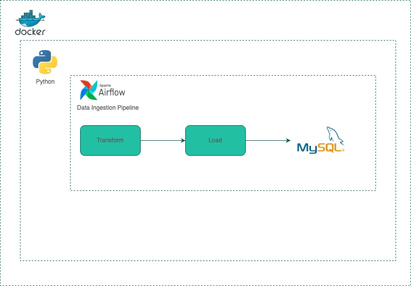
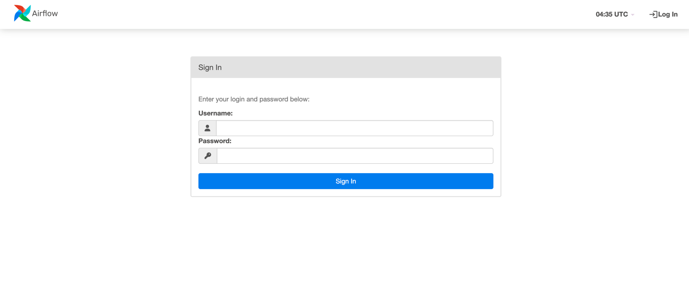
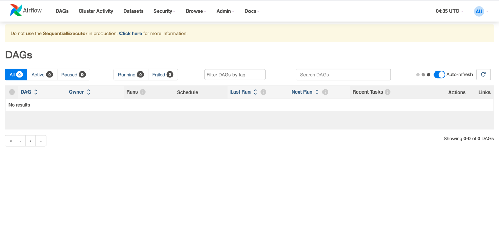
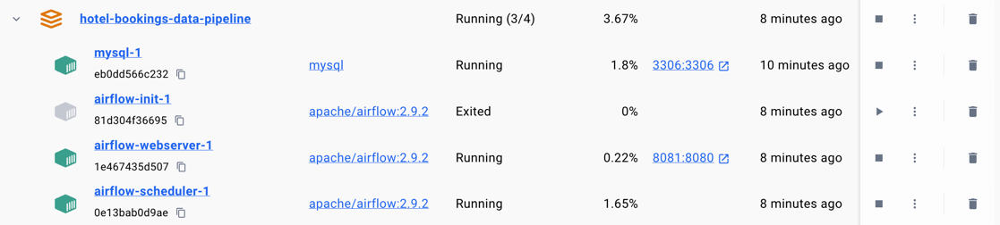

## Architecture:



## Setup:

1. Initialize the Database
```
$ docker-compose up airflow-init
```

2. Bring up all the services - mysql, airflow-scheduler, airflow-webserver
```commandline
$ docker compose up
```


- Credentials:
    admin, airflow

Landing page:




### Docker Compose Services:


### How to test:

- In terminal, type `docker ps` to find the container ID of airflow webserver.
- Then type in `docker exec -it [container_id of webserver] /bin/bash` to open an interactive terminal of your airflow container.
- Now you’re inside the Docker Container of Airflow, run command: 
  `airflow tasks test [dag_id, like vs-test-dag] [task_id, like task_a] [execution date, like 2021-01-01 (date in past)]`
- When you hit enter, Airflow will run this task and you can see the output in the console 
- Type `exit` to leave terminal when done testing 